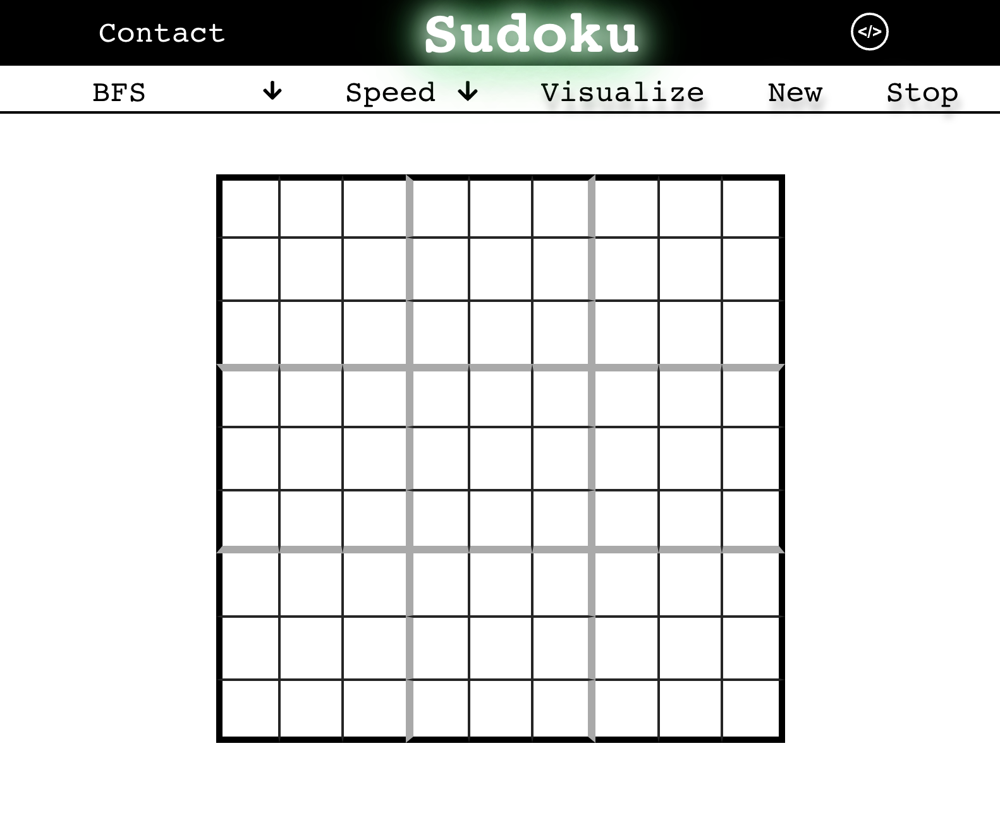
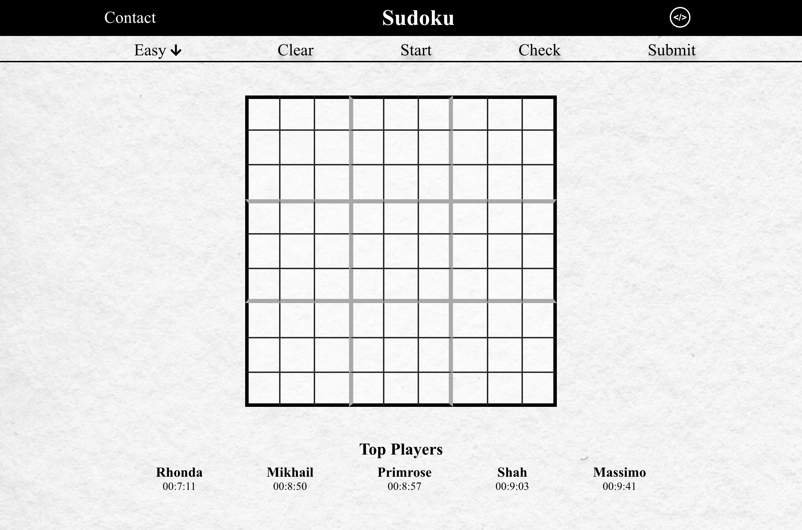

# InStock

## Demo link:
Access my site at [website](https://angrajlatake-sudoku.netlify.app/)

## Table of Content:

- [About The App](#about-the-app)
- [Screenshots](#screenshots)
- [Technologies](#technologies)
- [Setup](#setup)
- [License](#license)

## About The App
This is a sudoku solver visualizer. It uses, depth-first search and Best First search to find the answer. You can also play the game. Once you finish the game if you enter your name it is saved in the backend.

## Screenshots

## Technologies
  

## Setup
- download or clone the repository
- run `npm install`
- run `npm start`

## Features in next version
-Authentication
-Shared play mode
-Redux for state management

## License

MIT license @ [author](author.com)
